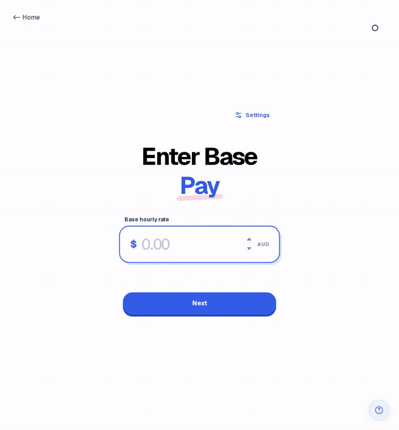

# Okanai

A weekly gross-pay calculator with daily shifts, unpaid breaks, and configurable overtime, weekend, and public-holiday rates.

Built with Next.js, React, TypeScript, Tailwind CSS, and GSAP.


## Calculator walkthrough



## Run locally

Requires Bun 1.2.22 and Node.js 20.9+.

```bash
bun install --frozen-lockfile
bun run dev
```

Open [localhost:3000/calculate](http://localhost:3000/calculate) to estimate your weekly pay and view daily earnings and hours. Entries stay in memory and reset on reload.

Estimates are in AUD, before tax, and exclude superannuation and award-specific rules.

## Commands

- Build: `bun run build`
- Serve the build: `bun run start`
- Tests: `bun test`
